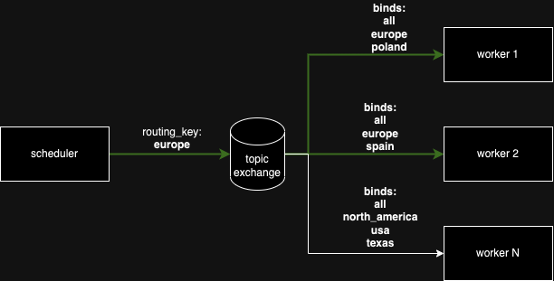
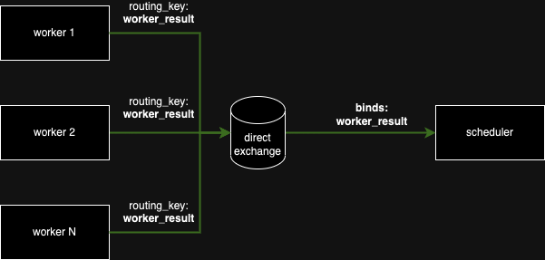

# Bandwith Measurement System (BMS)

## Infrastucture
- Scheduler (Rust)
- Worker (Rust)
- PostgresSQL
- RabbitMQ

## Environment variables

Example env file: [.env.example](./.env.example)

Global ENV:
- `DATABASE_URL`: URI to the postgres database
- `RABBITMQ_HOST`: Hostname of the RabbitMQ server
- `LOG_LEVEL`: Log level of the application (debug, info, warn, error)

Worker ENV:
- `WORKER_NAME`: Unique identifier of the worker, user to bind to the queue
- `WORKER_TOPICS`: Comma separated list of topics the worker is interested in (All workers are interested in the `all` topic)

## Dev Setup

1. `cp .env.example .env` to create the env file
1. `docker compose up -d` to start the RabbitMQ and PostgresSQL containers
1. `cargo run --bin scheduler` to start the scheduler
1. `WORKER_NAME=worker1 WORKER_TOPICS=all,europe,poland cargo run --bin worker` to start first worker
1. `WORKER_NAME=worker2 WORKER_TOPICS=all,europe,spain cargo run --bin worker` to start second worker

## RabbitMQ Communication

### Job Exchange

### Result Exchange

